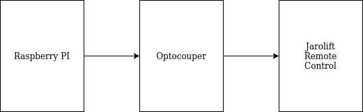

# jarolift domotic for raspberry pi

My idea is to manage and centralize all the control of electric blinds.

This service allows you to manage [jarolift](https://www.jarolift.de/rollladenmotoren.html) electric shutters from any browser.

### Required

* [Raspberry PI](https://www.raspberrypi.org/)
* [WiringPI](http://wiringpi.com/) generally installed in distros
* [Docker](https://www.docker.com/blog/happy-pi-day-docker-raspberry-pi/)
* Optocouper TLP504A-2
* Protoboard

##### Start service with docker

`docker run --rm --privileged -p 8080:8080 -ti oyola/jarolift-domotic`