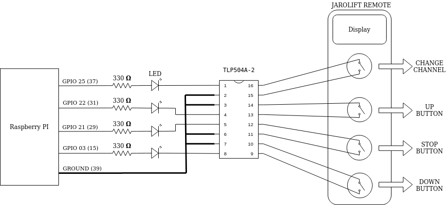
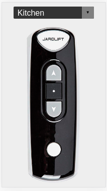

# jarolift domotic for raspberry pi

[Jarolift remote control](https://www.jarolift.de/files/jarolift/manuals/handsender/en/Jarolift_TDRC_08_16_EN.pdf) is ready to drive 8 motors for blinds. My intention is to manage and centralize all the control of electric blinds.

The service should be able to manage [jarolift electric shutters](https://www.jarolift.de/rollladenmotoren.html) from any browser within the same network.

   

#### Required

* [Raspberry PI](https://www.raspberrypi.org/)
* [WiringPI](http://wiringpi.com/) generally installed in distros
* [Docker](https://www.docker.com/blog/happy-pi-day-docker-raspberry-pi/)
* Optocoupler TLP504A-2
* Breadboard
* 4 Resistance 330 ohms
* Electronic Solder
* 4 LED (optional)

## Circuit diagram

The GPIO configuration file [GpioPulsableFactory.java](./src/main/java/com/jarolift/domotic/model/GpioPulsableFactory.java) 
and Raspberry PI [GPIO Pinout Diagram](https://pi4j.com/1.2/images/j8header-3b-plus.png) 

   

## Service

Java service using spring-boot. There are 2 profiles:

* `default` start the service using the library [pi4j](https://pi4j.com/) (only works in raspberry pi)

* `local` start the service showing traces (useful to develop)

The service is exposed on port 8080 and has the following endpoints::

* `/api/button/{button}/channel/{channel}` basic functions to manage the electric blinds
    * button (top|stop|down)
    * channel (0|1|2)

* `/api/middle/channel/{channel}` It is a special function of the remote control that allows to establish the third stop point, for that the stop button must be pressed for 4 seconds
    * channel (0|1|2)
    
`The channel 0 corresponds to ALL channels.`
 
The channels can be increased editing the variable `AVAILABLE_CHANNELS` of the file [OptocouperModel.java](./src/main/java/com/jarolift/domotic/model/OptocouperModel.java)
and adding more options to the `select` HTML tag [index.html](./src/main/resources/static/index.html)

Resources for the browser are in the folder `src/main/resources/static/` and require an updated browser.
The application is available at the URL: http://{SERVICE_IP}:8080 or [http://localhost:8080](http://localhost:8080) if the browser and service are on the same machine

   

### Start service with docker in raspberry PI

`docker run --rm --privileged -p 8080:8080 -ti oyola/jarolift-domotic`
